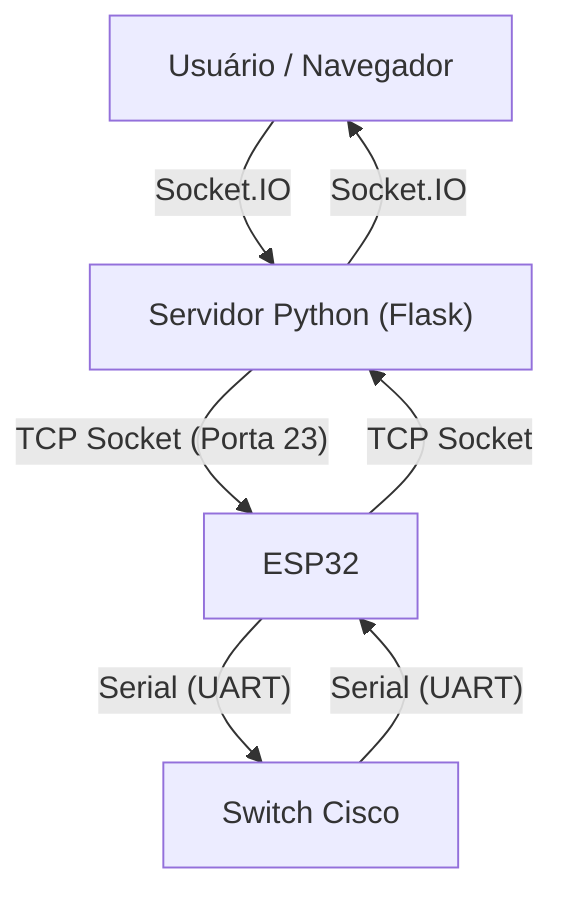

# 📡 Gerenciamento Remoto de Switch Cisco com ESP32

Este projeto consiste em um sistema completo para gerenciamento remoto de switches Cisco (ou outros dispositivos via console serial) através de uma interface Web amigável. O sistema utiliza um ESP32 como ponte (bridge) entre a rede Wi-Fi e a porta serial do switch, permitindo que administradores de rede acessem o console do equipamento sem a necessidade de uma conexão física direta via cabo console.

## 🏛️ Arquitetura do Sistema

O projeto é dividido em três camadas principais:

1.  **Frontend (Web):** Interface gráfica desenvolvida em HTML/CSS/JS que simula um terminal de comandos.
2.  **Backend (Python/Flask):** Servidor intermediário que gerencia a comunicação via WebSocket (Socket.IO) com o navegador e via TCP (Socket puro) com o ESP32.
3.  **Hardware (ESP32):** Firmware que converte pacotes TCP recebidos via Wi-Fi em sinais Seriais (UART) para o switch, e vice-versa.



---

## 🛠️ Tecnologias Utilizadas

*   **Microcontrolador:** ESP32 (Framework Arduino via PlatformIO)
*   **Linguagem Backend:** Python 3.12+
*   **Framework Web:** Flask + Flask-SocketIO
*   **Frontend:** HTML5, CSS3, JavaScript (jQuery), Socket.IO Client

---

## 🔌 Hardware e Conexões

Para o funcionamento correto, é necessário realizar a conexão física entre o ESP32 e a porta console do Switch. Como o nível lógico do RS-232 do switch (±12V) é diferente do TTL do ESP32 (3.3V), **é indispensável o uso de um conversor de nível (ex: MAX3232)**.

### Pinagem (Configurada no Firmware)

| ESP32 GPIO | Função | Conexão no Conversor RS232 |
| :--- | :--- | :--- |
| **GPIO 32** | RXD2 (Receive) | Conectar ao TX do Conversor |
| **GPIO 33** | TXD2 (Transmit) | Conectar ao RX do Conversor |
| **GND** | Terra | GND |
| **3V3/5V** | Alimentação | VCC |

> **Nota:** O baud rate configurado padrão é **9600**, comum em equipamentos Cisco.

---

## 🚀 Instalação e Configuração

### 1. Firmware (ESP32)

O código do firmware está localizado na pasta `src/`.

1.  Certifique-se de ter o **PlatformIO** instalado (extensão do VS Code).
2.  Abra o arquivo `src/main.cpp` e edite as credenciais do Wi-Fi:
    ```cpp
    const char* ssid     = "SUA_REDE_WIFI";
    const char* password = "SUA_SENHA";
    ```
3.  Conecte o ESP32 ao computador.
4.  Clique em **PlatformIO: Upload** para gravar o código.
5.  Abra o **Serial Monitor** (115200 baud) para verificar o endereço IP atribuído ao ESP32.

### 2. Servidor Web (Python)

O servidor web está na pasta `PythonWebServer/`.

1.  (Opcional) Crie e ative um ambiente virtual:
    ```bash
    python -m venv .venv
    source .venv/bin/activate  # Linux/Mac
    # ou
    .venv\Scripts\activate     # Windows
    ```
2.  Instale as dependências necessárias:
    ```bash
    pip install flask flask-socketio
    ```
3.  Execute a aplicação:
    ```bash
    python PythonWebServer/app.py
    ```
4.  O servidor iniciará na porta `5000`.

---

## 🖥️ Como Usar

1.  Ligue o ESP32 e o Switch Cisco.
2.  No computador, inicie o servidor Python (`app.py`).
3.  Abra o navegador e acesse `http://localhost:5000` (ou o IP da máquina rodando o servidor).
4.  Na interface web:
    *   Insira o **Endereço IP** do ESP32 (exibido no monitor serial ao ligar).
    *   Clique em **Conectar**.
5.  Utilize o terminal preto na tela para digitar comandos (ex: `enable`, `show run`, `conf t`).
    *   A resposta do switch aparecerá no histórico do terminal em tempo real.

---

## 👥 Créditos e Autoria

Este projeto foi desenvolvido no âmbito do **CTISM (Colégio Técnico Industrial de Santa Maria) - UFSM**.

### Bolsistas / Desenvolvedores
*   Lorenzo Michelotti Palma
*   Guilherme Fereira Da Silva

### Coordenação / Colaboração
*   Rafael Teodósio Pereira
*   Renato Preigschadt De Azevedo
*   Simone Regina Ceolin

---

**Licença:** Uso educacional e acadêmico.
